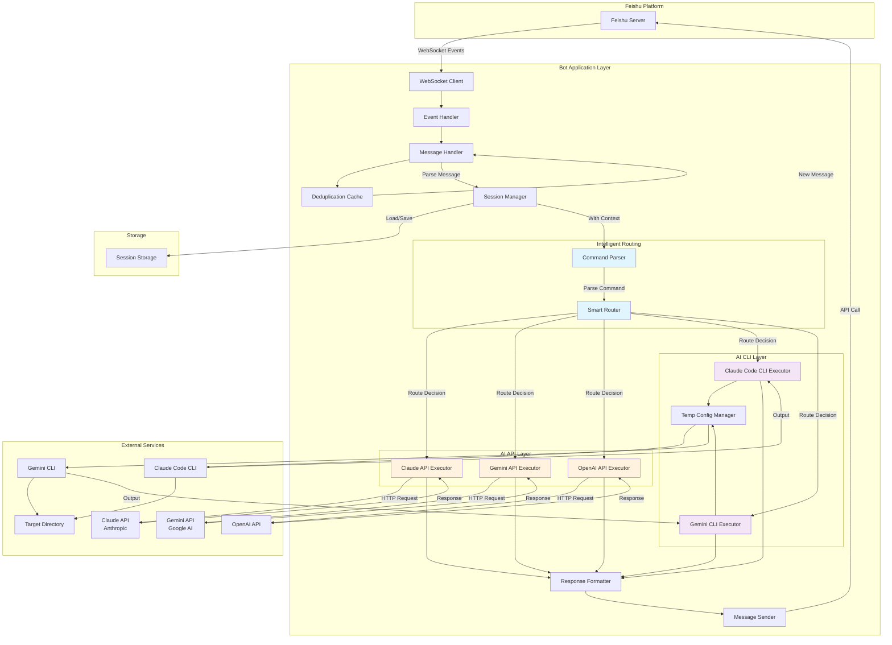
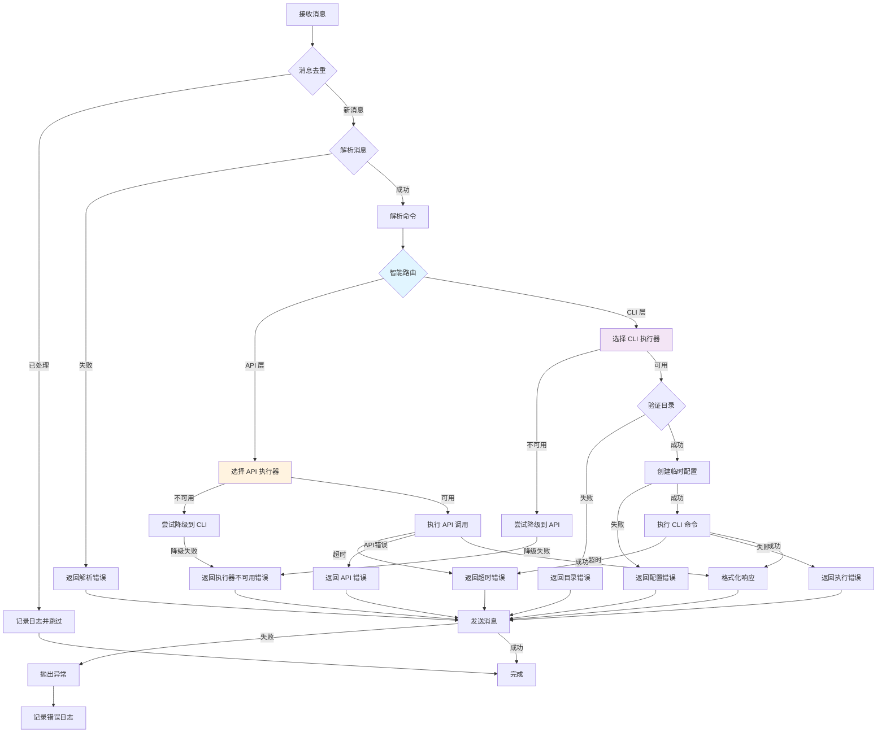

# Design Document: Feishu AI Bot

## Overview

飞书 AI 机器人是一个事件驱动的集成系统，通过 WebSocket 长连接接收飞书消息事件，解析用户请求，通过智能路由器选择合适的 AI 执行方式（API 层或 CLI 层），并将结果返回给用户。

系统支持两种 AI 执行方式：
1. **AI API 层**：直接调用 AI 模型 API（Claude API、Gemini API、OpenAI API），适合一般问答、解释概念等不需要访问代码库的任务
2. **AI CLI 层**：调用本地 AI CLI 工具（Claude Code CLI、Gemini CLI），适合需要访问代码库、执行命令、分析项目的任务

系统采用模块化设计和策略模式，将消息处理、智能路由、AI 执行、配置管理等功能分离，确保代码的可维护性和可扩展性。

核心设计原则：
- **事件驱动架构**：基于飞书 WebSocket 事件流处理消息
- **职责分离**：消息处理、智能路由、AI 执行、缓存管理等功能独立模块化
- **智能路由**：根据用户指令和消息内容自动选择最合适的 AI 执行方式
- **双层执行**：API 层提供快速响应，CLI 层提供深度代码能力
- **策略模式**：支持多个 AI 提供商，可灵活切换
- **错误隔离**：每个操作都有独立的错误处理，避免级联失败
- **资源管理**：临时资源（如配置目录）自动清理，防止资源泄漏

## Architecture

系统采用分层架构，核心是智能路由器，根据用户指令和消息内容选择 API 层或 CLI 层：



### 架构层次说明

1. **连接层（WebSocket Client）**
   - 维护与飞书服务器的 WebSocket 长连接
   - 接收实时消息事件
   - 处理连接异常和重连

2. **事件处理层（Event Handler）**
   - 注册和分发消息接收事件
   - 路由不同类型的事件到对应处理器

3. **业务逻辑层**
   - **Message Handler**: 解析消息内容，处理引用消息
   - **Deduplication Cache**: 消息去重，防止重复处理
   - **Session Manager**: 管理用户会话，维护对话历史

4. **智能路由层（新增）**
   - **Command Parser**: 解析用户命令，识别 AI 提供商指令
   - **Smart Router**: 根据命令和消息内容决定使用 API 层还是 CLI 层

5. **AI 执行层**
   - **AI API 层（新增）**:
     - **Claude API Executor**: 调用 Anthropic Claude API
     - **Gemini API Executor**: 调用 Google Gemini API
     - **OpenAI API Executor**: 调用 OpenAI API
     - 适合：一般问答、概念解释、翻译、写作等
     - **可扩展**: 通过实现 AIAPIExecutor 接口轻松添加新的 API 提供商
   
   - **AI CLI 层（现有）**:
     - **Claude Code CLI Executor**: 执行 Claude Code CLI 命令
     - **Gemini CLI Executor**: 执行 Gemini CLI 命令
     - **Temp Config Manager**: 管理临时配置目录
     - 适合：代码分析、文件操作、项目查看、命令执行等
     - **可扩展**: 通过实现 AICLIExecutor 接口轻松添加新的 CLI Agent（如 Qwen Code、Cursor AI 等）

### AI Agent 可扩展性设计

系统采用插件式架构，支持轻松添加新的 AI Agent：

1. **统一接口设计**
   - **AIAPIExecutor**: 所有 API 执行器的抽象基类
   - **AICLIExecutor**: 所有 CLI 执行器的抽象基类
   - 新 Agent 只需实现对应接口即可集成

2. **Agent 注册机制**
   - **ExecutorRegistry**: 中央注册表，管理所有可用的执行器
   - 支持动态注册和发现 Agent
   - 支持 Agent 元数据（名称、版本、能力描述）
   - 支持 Agent 优先级和降级策略

3. **配置驱动**
   - 通过配置文件声明可用的 Agent
   - 支持 Agent 特定配置（API 密钥、CLI 路径、参数等）
   - 支持热加载配置（无需重启）

4. **扩展示例**
   - 添加 Qwen Code CLI Agent：
     ```python
     class QwenCodeCLIExecutor(AICLIExecutor):
         def get_command_name(self) -> str:
             return "qwen-code"
         
         def build_command_args(self, user_prompt, additional_params):
             # 实现 Qwen Code 特定的命令参数构建
             pass
     ```
   - 注册到系统：
     ```python
     registry.register_cli_executor("qwen-code", QwenCodeCLIExecutor)
     ```

5. **命令前缀扩展**
   - 支持为新 Agent 添加命令前缀
   - 配置格式：`{"@qwen": {"provider": "qwen-code", "layer": "cli"}}`
   - 自动更新命令解析器

6. **未来扩展方向**
   - 支持更多 CLI Agent：Cursor AI、Codeium、Tabnine 等
   - 支持更多 API 提供商：Anthropic、Google、OpenAI、Cohere、Mistral 等
   - 支持混合执行：同时调用多个 Agent 并合并结果
   - 支持 Agent 链：一个 Agent 的输出作为另一个 Agent 的输入

6. **响应层**
   - **Response Formatter**: 格式化响应消息
   - **Message Sender**: 根据聊天类型选择发送策略，调用飞书 OpenAPI

7. **存储层**
   - **Session Storage**: 持久化会话数据（JSON 文件存储）
   - **Executor Session Storage**: 存储 AI CLI 会话映射（user_id → session_id）
   - **Configuration Storage**: 存储配置信息（环境变量 + 配置文件）

### 存储层设计

系统采用轻量级文件存储方案，避免引入数据库依赖：

1. **会话存储（Session Storage）**
   - 存储格式：JSON 文件
   - 存储路径：可配置（默认 `./data/sessions.json`）
   - 存储内容：
     - 活跃会话：当前用户的会话数据
     - 归档会话：历史会话数据（存储在 `./data/archived_sessions/` 目录）
   - 持久化策略：
     - 每次会话更新后自动保存
     - 应用启动时加载所有会话
     - 定期清理过期会话（可配置清理间隔）
   - 数据结构：
     ```json
     {
       "sessions": {
         "user_id_1": {
           "session_id": "uuid",
           "user_id": "ou_xxx",
           "created_at": 1234567890,
           "last_active": 1234567890,
           "messages": [
             {"role": "user", "content": "...", "timestamp": 1234567890},
             {"role": "assistant", "content": "...", "timestamp": 1234567890}
           ]
         }
       }
     }
     ```

2. **AI CLI 会话映射存储（Executor Session Storage）**
   - 存储格式：JSON 文件
   - 存储路径：可配置（默认 `./data/executor_sessions.json`）
   - 存储内容：
     - Claude Code CLI 会话映射：`{user_id: claude_session_id}`
     - Gemini CLI 会话映射：`{user_id: gemini_session_id}`
   - 持久化策略：
     - 每次会话映射更新后自动保存
     - 应用启动时加载所有映射
   - 数据结构：
     ```json
     {
       "claude_cli_sessions": {
         "user_id_1": "claude_session_id_1",
         "user_id_2": "claude_session_id_2"
       },
       "gemini_cli_sessions": {
         "user_id_1": "gemini_session_id_1",
         "user_id_2": "gemini_session_id_2"
       }
     }
     ```

3. **配置存储（Configuration Storage）**
   - 存储格式：环境变量 + 配置文件（.env）
   - 配置文件路径：可配置（默认 `./.env`）
   - 配置内容：
     - 飞书应用配置（app_id, app_secret）
     - AI API 密钥（claude_api_key, gemini_api_key, openai_api_key）
     - AI CLI 配置（target_directory, ai_timeout）
     - 会话管理配置（session_storage_path, max_session_messages, session_timeout）
     - 路由配置（default_provider, default_layer）
     - 日志配置（log_level）
   - 加载优先级：环境变量 > 配置文件 > 默认值

4. **存储优势**
   - 轻量级：无需数据库，易于部署
   - 可移植：JSON 文件易于备份和迁移
   - 可读性：JSON 格式易于调试和查看
   - 性能：小规模数据（< 1000 用户）性能足够
   - 扩展性：未来可以轻松迁移到数据库（Redis、MongoDB 等）

5. **存储限制和优化**
   - 单文件大小限制：建议 < 10MB
   - 会话数量限制：建议 < 1000 个活跃会话
   - 自动清理：定期清理过期会话和归档旧会话
   - 备份策略：建议定期备份 `./data/` 目录
   - 并发控制：使用文件锁避免并发写入冲突（Python `fcntl` 或 `filelock` 库）

## Components and Interfaces

### 1. WebSocket Client

**职责**: 维护与飞书服务器的长连接，接收消息事件

**接口**:
```python
class WebSocketClient:
    def __init__(self, app_id: str, app_secret: str, event_handler: EventHandler):
        """初始化 WebSocket 客户端"""
        
    def start(self) -> None:
        """启动长连接，开始接收事件"""
        
    def stop(self) -> None:
        """停止长连接"""
```

**依赖**:
- `lark_oapi.ws.Client`: 飞书 SDK 提供的 WebSocket 客户端

### 2. Event Handler

**职责**: 注册和分发消息事件到对应的处理函数

**接口**:
```python
class EventHandler:
    def register_message_receive_handler(
        self, 
        handler: Callable[[MessageReceiveEvent], None]
    ) -> None:
        """注册消息接收处理器"""
        
    def dispatch_event(self, event: Event) -> None:
        """分发事件到对应的处理器"""
```

**依赖**:
- `lark_oapi.EventDispatcherHandler`: 飞书 SDK 事件分发器

### 3. Message Handler

**职责**: 解析消息内容，处理文本消息和引用消息

**接口**:
```python
class MessageHandler:
    def __init__(self, client: LarkClient, dedup_cache: DeduplicationCache):
        """初始化消息处理器"""
        
    def parse_message_content(self, message: Message) -> str:
        """解析消息内容，返回文本内容"""
        
    def get_quoted_message(self, parent_id: str) -> Optional[str]:
        """获取引用消息的内容"""
        
    def combine_messages(self, quoted: Optional[str], current: str) -> str:
        """组合引用消息和当前消息"""
```

**实现细节**:
- 支持文本消息类型（`message_type == "text"`）
- 对于非文本消息，返回错误提示
- 引用消息通过 `parent_id` 获取，调用飞书 API `im.v1.message.get`
- 支持引用文本消息和卡片消息（interactive）
- 组合消息格式：`引用消息：{quoted}\n\n当前消息：{current}`

### 4. Deduplication Cache

**职责**: 缓存已处理的消息 ID，防止重复处理

**接口**:
```python
class DeduplicationCache:
    def __init__(self, max_size: int = 1000):
        """初始化去重缓存，指定最大容量"""
        
    def is_processed(self, message_id: str) -> bool:
        """检查消息是否已处理"""
        
    def mark_processed(self, message_id: str) -> None:
        """标记消息为已处理"""
```

**实现细节**:
- 使用 `collections.deque` 实现 FIFO 队列
- 设置 `maxlen=1000`，自动移除最早的条目
- 时间复杂度：O(n) 查找，O(1) 插入

### 5. Session Manager

**职责**: 管理用户会话，维护对话历史，支持上下文连续对话

**接口**:
```python
class SessionManager:
    def __init__(self, storage_path: str, max_messages: int = 50, session_timeout: int = 86400):
        """初始化会话管理器
        
        Args:
            storage_path: 会话存储路径
            max_messages: 单个会话最大消息数
            session_timeout: 会话超时时间（秒），默认 24 小时
        """
        
    def get_or_create_session(self, user_id: str) -> Session:
        """获取或创建用户会话"""
        
    def add_message(self, user_id: str, role: str, content: str) -> None:
        """添加消息到会话历史
        
        Args:
            user_id: 用户 ID
            role: 消息角色（user 或 assistant）
            content: 消息内容
        """
        
    def get_conversation_history(self, user_id: str, max_messages: Optional[int] = None) -> List[Message]:
        """获取会话的对话历史"""
        
    def create_new_session(self, user_id: str) -> Session:
        """为用户创建新会话，归档旧会话"""
        
    def get_session_info(self, user_id: str) -> Dict[str, Any]:
        """获取会话信息（ID、消息数、创建时间等）"""
        
    def format_history_for_ai(self, user_id: str) -> str:
        """将对话历史格式化为 AI 可读的上下文"""
        
    def cleanup_expired_sessions(self) -> int:
        """清理过期会话，返回清理数量"""
        
    def save_sessions(self) -> None:
        """持久化所有会话到存储"""
        
    def load_sessions(self) -> None:
        """从存储加载会话"""
```

**实现细节**:
- 使用 JSON 文件持久化会话数据（`sessions.json`）
- 使用文件锁（`filelock` 库）避免并发写入冲突
- 每个用户维护一个活跃会话
- 会话数据结构：
  ```python
  {
      "session_id": "uuid",
      "user_id": "ou_xxx",
      "created_at": 1234567890,
      "last_active": 1234567890,
      "messages": [
          {"role": "user", "content": "...", "timestamp": 1234567890},
          {"role": "assistant", "content": "...", "timestamp": 1234567890}
      ]
  }
  ```
- 自动检测会话是否需要轮换（超过最大消息数或超时）
- 归档的旧会话保存到 `archived_sessions/` 目录，文件名格式：`{user_id}_{session_id}_{timestamp}.json`
- 对话历史格式化为：
  ```
  Previous conversation:
  User: {message1}
  Assistant: {response1}
  User: {message2}
  Assistant: {response2}
  ...
  
  Current question: {current_message}
  ```
- 支持命令识别：
  - `/new` 或 `新会话`：创建新会话
  - `/session` 或 `会话信息`：查看会话信息
  - `/history` 或 `历史记录`：查看对话历史
- 定期清理过期会话（可配置清理间隔，默认每小时）
- 存储文件路径可配置（默认 `./data/sessions.json`）

**双层会话管理策略**:

系统采用双层会话管理架构，以充分利用不同 AI CLI 的原生能力：

1. **飞书机器人会话层**（Session Manager）:
   - 目的：管理用户与机器人的交互历史，提供会话信息查询和历史记录查看
   - 功能：会话创建、消息存储、会话轮换、持久化
   - 适用于：所有 AI 提供商

2. **AI CLI 原生会话层**:
   - 目的：利用 AI CLI 工具的原生会话管理能力，让 AI 自己维护上下文
   - 功能：由 AI CLI 自动管理对话上下文，无需手动传递历史
   - 适用于：Claude Code CLI 和 Gemini CLI（均支持原生会话）

3. **统一策略**:
   - **Claude Code CLI**：使用 Claude Code 的 `--session` 参数，利用其原生会话管理
     - 飞书机器人会话：仅用于显示历史记录和会话信息
     - Claude Code 会话：用于实际的 AI 上下文管理
     - 当用户发送 `/new` 时，同时清除两层会话
   
   - **Gemini CLI**：使用 Gemini CLI 的 `--session` 参数，利用其原生会话管理
     - 飞书机器人会话：仅用于显示历史记录和会话信息
     - Gemini CLI 会话：用于实际的 AI 上下文管理
     - 当用户发送 `/new` 时，同时清除两层会话

4. **优势**:
   - 对于所有支持原生会话的 AI，减少提示长度，提高效率
   - 利用 AI 原生能力，获得更好的上下文理解
   - 用户可以查看和管理会话，无论使用哪个 AI 提供商
   - 统一的会话管理接口，易于扩展支持新的 AI 提供商
   - 如果未来有不支持原生会话的 AI，可以回退到手动传递对话历史的方式

### 6. Command Parser

**职责**: 解析用户消息，识别 AI 提供商指令和命令类型

**接口**:
```python
class CommandParser:
    def parse_command(self, message: str) -> ParsedCommand:
        """解析用户消息，返回解析结果
        
        Returns:
            ParsedCommand: 包含 AI 提供商、执行层（API/CLI）、实际消息内容
        """
        
    def extract_provider_prefix(self, message: str) -> Optional[str]:
        """提取 AI 提供商前缀（如 @claude-api, @gemini-cli）"""
        
    def detect_cli_keywords(self, message: str) -> bool:
        """检测消息是否包含需要 CLI 层的关键词"""
```

**实现细节**:
- 支持的命令前缀：
  - `@claude-api` 或 `@claude` → Claude API
  - `@gemini-api` 或 `@gemini` → Gemini API
  - `@openai` 或 `@gpt` → OpenAI API
  - `@claude-cli` 或 `@code` → Claude Code CLI
  - `@gemini-cli` → Gemini CLI

- CLI 关键词检测（中英文）：
  - 代码相关：`查看代码`、`修改文件`、`分析代码`、`代码库`、`view code`、`modify file`、`analyze code`、`codebase`
  - 文件操作：`读取文件`、`写入文件`、`创建文件`、`read file`、`write file`、`create file`
  - 命令执行：`执行命令`、`运行脚本`、`execute command`、`run script`
  - 项目分析：`分析项目`、`项目结构`、`analyze project`、`project structure`

- 解析结果数据结构：
  ```python
  @dataclass
  class ParsedCommand:
      provider: str           # AI 提供商：claude, gemini, openai
      execution_layer: str    # 执行层：api 或 cli
      message: str            # 去除前缀后的实际消息内容
      explicit: bool          # 是否显式指定（用户使用了前缀）
  ```

### 7. Smart Router

**职责**: 根据解析的命令和消息内容，决定使用哪个 AI 执行器

**接口**:
```python
class SmartRouter:
    def __init__(
        self, 
        executor_registry: ExecutorRegistry,
        default_provider: str = "claude",
        default_layer: str = "api"
    ):
        """初始化智能路由器
        
        Args:
            executor_registry: 执行器注册表
            default_provider: 默认 AI 提供商
            default_layer: 默认执行层（api 或 cli）
        """
        
    def route(self, parsed_command: ParsedCommand) -> AIExecutor:
        """根据解析的命令选择合适的执行器"""
        
    def get_executor(self, provider: str, layer: str) -> AIExecutor:
        """获取指定提供商和层的执行器"""
```

**路由策略**:

1. **显式指定优先**：
   - 如果用户使用了命令前缀（如 `@claude-api`），直接使用指定的提供商和层
   - 忽略智能判断，完全按用户指令执行

2. **智能判断**（用户未指定时）：
   - 检测 CLI 关键词：如果消息包含代码、文件、命令相关关键词 → CLI 层
   - 默认使用 API 层：一般问答、概念解释、翻译等 → API 层
   - 默认提供商：Claude（可配置）

3. **降级策略**：
   - 如果指定的执行器不可用（未配置或初始化失败），尝试降级到其他可用执行器
   - API 层不可用 → 降级到 CLI 层
   - CLI 层不可用 → 降级到 API 层
   - 记录降级日志

**实现细节**:
```python
def route(self, parsed_command: ParsedCommand) -> AIExecutor:
    provider = parsed_command.provider
    layer = parsed_command.execution_layer
    
    # 如果用户显式指定，直接使用
    if parsed_command.explicit:
        return self.executor_registry.get_executor(provider, layer)
    
    # 智能判断：检测是否需要 CLI 层
    if self.command_parser.detect_cli_keywords(parsed_command.message):
        layer = "cli"
    else:
        layer = self.default_layer  # 默认 API 层
    
    # 获取执行器，如果不可用则降级
    try:
        return self.executor_registry.get_executor(provider, layer)
    except ExecutorNotAvailableError:
        # 尝试降级
        fallback_layer = "cli" if layer == "api" else "api"
        logger.warning(f"Executor {provider}/{layer} not available, falling back to {fallback_layer}")
        return self.executor_registry.get_executor(provider, fallback_layer)
```

### 7.1 Executor Registry

**职责**: 管理所有 AI 执行器的注册、发现和获取

**接口**:
```python
class ExecutorRegistry:
    def __init__(self):
        """初始化执行器注册表"""
        self.api_executors: Dict[str, AIAPIExecutor] = {}
        self.cli_executors: Dict[str, AICLIExecutor] = {}
        self.executor_metadata: Dict[str, ExecutorMetadata] = {}
        
    def register_api_executor(
        self, 
        provider: str, 
        executor: AIAPIExecutor,
        metadata: Optional[ExecutorMetadata] = None
    ) -> None:
        """注册 API 执行器"""
        
    def register_cli_executor(
        self, 
        provider: str, 
        executor: AICLIExecutor,
        metadata: Optional[ExecutorMetadata] = None
    ) -> None:
        """注册 CLI 执行器"""
        
    def get_executor(self, provider: str, layer: str) -> AIExecutor:
        """获取指定提供商和层的执行器
        
        Raises:
            ExecutorNotAvailableError: 如果执行器不可用
        """
        
    def list_available_executors(self, layer: Optional[str] = None) -> List[str]:
        """列出所有可用的执行器"""
        
    def get_executor_metadata(self, provider: str, layer: str) -> ExecutorMetadata:
        """获取执行器元数据"""
        
    def is_executor_available(self, provider: str, layer: str) -> bool:
        """检查执行器是否可用"""
```

**ExecutorMetadata 数据结构**:
```python
@dataclass
class ExecutorMetadata:
    name: str                    # 执行器名称
    provider: str                # 提供商名称
    layer: str                   # 执行层（api 或 cli）
    version: str                 # 版本号
    description: str             # 描述
    capabilities: List[str]      # 能力列表（如 "code_analysis", "file_operations"）
    command_prefixes: List[str]  # 支持的命令前缀（如 ["@claude", "@claude-api"]）
    priority: int                # 优先级（用于降级策略）
    config_required: List[str]   # 必需的配置项（如 ["api_key"]）
```

**实现细节**:
- 使用字典存储执行器实例，键为 `{provider}_{layer}`
- 支持动态注册和注销执行器
- 在获取执行器时检查可用性
- 缓存执行器可用性状态，避免重复检查
- 支持从配置文件加载执行器注册信息

**扩展示例**:
```python
# 注册 Qwen Code CLI 执行器
qwen_executor = QwenCodeCLIExecutor(target_dir="/path/to/repo")
qwen_metadata = ExecutorMetadata(
    name="Qwen Code CLI",
    provider="qwen-code",
    layer="cli",
    version="1.0.0",
    description="Qwen Code AI Agent for code analysis and generation",
    capabilities=["code_analysis", "code_generation", "file_operations"],
    command_prefixes=["@qwen", "@qwen-code"],
    priority=3,
    config_required=["target_directory"]
)
registry.register_cli_executor("qwen-code", qwen_executor, qwen_metadata)

# 更新命令解析器以支持新前缀
command_parser.add_prefix_mapping("@qwen", "qwen-code", "cli")
command_parser.add_prefix_mapping("@qwen-code", "qwen-code", "cli")
```

### 8. AI API Executor (Abstract Interface)

**职责**: 定义 AI API 执行器的通用接口

**接口**:
```python
from abc import ABC, abstractmethod

class AIAPIExecutor(ABC):
    def __init__(self, api_key: str, model: Optional[str] = None, timeout: int = 60):
        """初始化 AI API 执行器
        
        Args:
            api_key: API 密钥
            model: 模型名称（可选，使用默认模型）
            timeout: 请求超时时间（秒）
        """
        self.api_key = api_key
        self.model = model
        self.timeout = timeout
        
    @abstractmethod
    def execute(
        self, 
        user_prompt: str, 
        conversation_history: Optional[List[Message]] = None,
        additional_params: Optional[Dict[str, Any]] = None
    ) -> ExecutionResult:
        """执行 AI API 调用，返回执行结果
        
        Args:
            user_prompt: 用户提示
            conversation_history: 对话历史（用于上下文）
            additional_params: 额外参数（如 temperature, max_tokens）
        """
        pass
        
    @abstractmethod
    def get_provider_name(self) -> str:
        """返回 AI 提供商名称"""
        pass
        
    @abstractmethod
    def format_messages(
        self, 
        user_prompt: str, 
        conversation_history: Optional[List[Message]] = None
    ) -> List[Dict[str, str]]:
        """将用户提示和对话历史格式化为 API 所需的消息格式"""
        pass
```

### 8.1 Claude API Executor

**职责**: 调用 Anthropic Claude API

**实现**:
```python
class ClaudeAPIExecutor(AIAPIExecutor):
    def __init__(
        self, 
        api_key: str, 
        model: str = "claude-3-5-sonnet-20241022",
        timeout: int = 60
    ):
        """初始化 Claude API 执行器
        
        Args:
            api_key: Anthropic API 密钥
            model: Claude 模型名称
            timeout: 请求超时时间
        """
        super().__init__(api_key, model, timeout)
        self.api_base = "https://api.anthropic.com/v1"
        self.client = anthropic.Anthropic(api_key=api_key)
    
    def get_provider_name(self) -> str:
        return "claude-api"
    
    def format_messages(
        self, 
        user_prompt: str, 
        conversation_history: Optional[List[Message]] = None
    ) -> List[Dict[str, str]]:
        """格式化为 Claude API 消息格式"""
        messages = []
        
        # 添加对话历史
        if conversation_history:
            for msg in conversation_history:
                messages.append({
                    "role": msg.role,  # "user" 或 "assistant"
                    "content": msg.content
                })
        
        # 添加当前用户消息
        messages.append({
            "role": "user",
            "content": user_prompt
        })
        
        return messages
    
    def execute(
        self, 
        user_prompt: str, 
        conversation_history: Optional[List[Message]] = None,
        additional_params: Optional[Dict[str, Any]] = None
    ) -> ExecutionResult:
        """调用 Claude API"""
        try:
            messages = self.format_messages(user_prompt, conversation_history)
            
            # 构建请求参数
            request_params = {
                "model": self.model,
                "messages": messages,
                "max_tokens": additional_params.get("max_tokens", 4096) if additional_params else 4096,
            }
            
            # 添加可选参数
            if additional_params:
                if "temperature" in additional_params:
                    request_params["temperature"] = additional_params["temperature"]
                if "system" in additional_params:
                    request_params["system"] = additional_params["system"]
            
            # 调用 API
            start_time = time.time()
            response = self.client.messages.create(**request_params)
            execution_time = time.time() - start_time
            
            # 提取响应内容
            content = response.content[0].text
            
            return ExecutionResult(
                success=True,
                stdout=content,
                stderr="",
                error_message=None,
                execution_time=execution_time
            )
            
        except anthropic.APIError as e:
            return ExecutionResult(
                success=False,
                stdout="",
                stderr=str(e),
                error_message=f"Claude API error: {e}",
                execution_time=0
            )
        except Exception as e:
            return ExecutionResult(
                success=False,
                stdout="",
                stderr=str(e),
                error_message=f"Unexpected error: {e}",
                execution_time=0
            )
```

**支持的 Claude API 功能**（参考：https://docs.anthropic.com/en/api/messages）:
- **模型选择**:
  - `claude-3-5-sonnet-20241022`（默认，最新最强）
  - `claude-3-5-haiku-20241022`（快速响应）
  - `claude-3-opus-20240229`（最强推理）
- **参数配置**:
  - `max_tokens`: 最大输出 token 数
  - `temperature`: 温度参数（0-1）
  - `system`: 系统提示
  - `top_p`: 核采样参数
- **对话历史**: 支持多轮对话上下文

### 8.2 Gemini API Executor

**职责**: 调用 Google Gemini API

**实现**:
```python
class GeminiAPIExecutor(AIAPIExecutor):
    def __init__(
        self, 
        api_key: str, 
        model: str = "gemini-2.0-flash-exp",
        timeout: int = 60
    ):
        """初始化 Gemini API 执行器
        
        Args:
            api_key: Google AI API 密钥
            model: Gemini 模型名称
            timeout: 请求超时时间
        """
        super().__init__(api_key, model, timeout)
        genai.configure(api_key=api_key)
        self.client = genai.GenerativeModel(model)
    
    def get_provider_name(self) -> str:
        return "gemini-api"
    
    def format_messages(
        self, 
        user_prompt: str, 
        conversation_history: Optional[List[Message]] = None
    ) -> List[Dict[str, str]]:
        """格式化为 Gemini API 消息格式"""
        messages = []
        
        # 添加对话历史
        if conversation_history:
            for msg in conversation_history:
                messages.append({
                    "role": "user" if msg.role == "user" else "model",
                    "parts": [msg.content]
                })
        
        # 添加当前用户消息
        messages.append({
            "role": "user",
            "parts": [user_prompt]
        })
        
        return messages
    
    def execute(
        self, 
        user_prompt: str, 
        conversation_history: Optional[List[Message]] = None,
        additional_params: Optional[Dict[str, Any]] = None
    ) -> ExecutionResult:
        """调用 Gemini API"""
        try:
            # 构建生成配置
            generation_config = {}
            if additional_params:
                if "temperature" in additional_params:
                    generation_config["temperature"] = additional_params["temperature"]
                if "max_tokens" in additional_params:
                    generation_config["max_output_tokens"] = additional_params["max_tokens"]
            
            # 如果有对话历史，使用 chat 模式
            if conversation_history:
                chat = self.client.start_chat(history=[
                    {"role": "user" if msg.role == "user" else "model", "parts": [msg.content]}
                    for msg in conversation_history
                ])
                start_time = time.time()
                response = chat.send_message(user_prompt, generation_config=generation_config)
                execution_time = time.time() - start_time
            else:
                # 单次生成
                start_time = time.time()
                response = self.client.generate_content(
                    user_prompt,
                    generation_config=generation_config
                )
                execution_time = time.time() - start_time
            
            return ExecutionResult(
                success=True,
                stdout=response.text,
                stderr="",
                error_message=None,
                execution_time=execution_time
            )
            
        except Exception as e:
            return ExecutionResult(
                success=False,
                stdout="",
                stderr=str(e),
                error_message=f"Gemini API error: {e}",
                execution_time=0
            )
```

**支持的 Gemini API 功能**（参考：https://ai.google.dev/api/python/google/generativeai）:
- **模型选择**:
  - `gemini-2.0-flash-exp`（默认，最新实验版）
  - `gemini-1.5-pro`（强大推理）
  - `gemini-1.5-flash`（快速响应）
- **参数配置**:
  - `max_output_tokens`: 最大输出 token 数
  - `temperature`: 温度参数
  - `top_p`: 核采样参数
  - `top_k`: Top-K 采样
- **对话历史**: 支持 chat 模式的多轮对话

### 8.3 OpenAI API Executor

**职责**: 调用 OpenAI API

**实现**:
```python
class OpenAIAPIExecutor(AIAPIExecutor):
    def __init__(
        self, 
        api_key: str, 
        model: str = "gpt-4o",
        timeout: int = 60
    ):
        """初始化 OpenAI API 执行器
        
        Args:
            api_key: OpenAI API 密钥
            model: OpenAI 模型名称
            timeout: 请求超时时间
        """
        super().__init__(api_key, model, timeout)
        self.client = openai.OpenAI(api_key=api_key)
    
    def get_provider_name(self) -> str:
        return "openai-api"
    
    def format_messages(
        self, 
        user_prompt: str, 
        conversation_history: Optional[List[Message]] = None
    ) -> List[Dict[str, str]]:
        """格式化为 OpenAI API 消息格式"""
        messages = []
        
        # 添加对话历史
        if conversation_history:
            for msg in conversation_history:
                messages.append({
                    "role": msg.role,  # "user" 或 "assistant"
                    "content": msg.content
                })
        
        # 添加当前用户消息
        messages.append({
            "role": "user",
            "content": user_prompt
        })
        
        return messages
    
    def execute(
        self, 
        user_prompt: str, 
        conversation_history: Optional[List[Message]] = None,
        additional_params: Optional[Dict[str, Any]] = None
    ) -> ExecutionResult:
        """调用 OpenAI API"""
        try:
            messages = self.format_messages(user_prompt, conversation_history)
            
            # 构建请求参数
            request_params = {
                "model": self.model,
                "messages": messages,
            }
            
            # 添加可选参数
            if additional_params:
                if "temperature" in additional_params:
                    request_params["temperature"] = additional_params["temperature"]
                if "max_tokens" in additional_params:
                    request_params["max_tokens"] = additional_params["max_tokens"]
            
            # 调用 API
            start_time = time.time()
            response = self.client.chat.completions.create(**request_params)
            execution_time = time.time() - start_time
            
            # 提取响应内容
            content = response.choices[0].message.content
            
            return ExecutionResult(
                success=True,
                stdout=content,
                stderr="",
                error_message=None,
                execution_time=execution_time
            )
            
        except openai.APIError as e:
            return ExecutionResult(
                success=False,
                stdout="",
                stderr=str(e),
                error_message=f"OpenAI API error: {e}",
                execution_time=0
            )
        except Exception as e:
            return ExecutionResult(
                success=False,
                stdout="",
                stderr=str(e),
                error_message=f"Unexpected error: {e}",
                execution_time=0
            )
```

**支持的 OpenAI API 功能**（参考：https://platform.openai.com/docs/api-reference/chat）:
- **模型选择**:
  - `gpt-4o`（默认，最新最强）
  - `gpt-4o-mini`（快速响应）
  - `gpt-4-turbo`（强大推理）
- **参数配置**:
  - `max_tokens`: 最大输出 token 数
  - `temperature`: 温度参数（0-2）
  - `top_p`: 核采样参数
  - `frequency_penalty`: 频率惩罚
  - `presence_penalty`: 存在惩罚
- **对话历史**: 支持多轮对话上下文

### 9. AI CLI Executor (Abstract Interface)

**职责**: 定义 AI CLI 执行器的通用接口

**接口**:
```python
from abc import ABC, abstractmethod

class AICLIExecutor(ABC):
    def __init__(self, target_dir: str, timeout: int = 600):
        """初始化 AI CLI 执行器"""
        self.target_dir = target_dir
        self.timeout = timeout
        
    @abstractmethod
    def execute(self, user_prompt: str, additional_params: Optional[Dict[str, Any]] = None) -> ExecutionResult:
        """执行 AI CLI 命令，返回执行结果"""
        pass
        
    @abstractmethod
    def verify_directory(self) -> bool:
        """验证目标目录是否存在"""
        pass
        
    @abstractmethod
    def get_command_name(self) -> str:
        """返回 AI 命令名称"""
        pass
        
    @abstractmethod
    def build_command_args(self, user_prompt: str, additional_params: Optional[Dict[str, Any]] = None) -> List[str]:
        """构建 AI 命令参数列表"""
        pass
```

### 9.1 Claude Code CLI Executor

**职责**: 执行 Claude Code CLI 命令，支持 Claude Code 的原生会话管理

**实现**:
```python
class ClaudeCodeCLIExecutor(AICLIExecutor):
    def __init__(self, target_dir: str, timeout: int = 600, use_native_session: bool = True):
        """初始化 Claude 执行器
        
        Args:
            target_dir: 目标目录
            timeout: 超时时间
            use_native_session: 是否使用 Claude Code 的原生会话管理
        """
        super().__init__(target_dir, timeout)
        self.use_native_session = use_native_session
        self.session_map = {}  # user_id -> claude_session_id 映射
    
    def get_command_name(self) -> str:
        """Windows 使用 claude.cmd，Unix-like 使用 claude"""
        return "claude.cmd" if platform.system() == "Windows" else "claude"
    
    def get_or_create_claude_session(self, user_id: str) -> Optional[str]:
        """获取或创建 Claude Code 会话
        
        如果启用了原生会话管理，为每个用户维护一个 Claude Code 会话
        """
        if not self.use_native_session:
            return None
        
        if user_id not in self.session_map:
            # 创建新的 Claude Code 会话
            # 会话 ID 由 Claude Code 自动生成
            self.session_map[user_id] = None  # 首次执行时会获取
        
        return self.session_map.get(user_id)
        
    def build_command_args(
        self, 
        user_prompt: str, 
        additional_params: Optional[Dict[str, Any]] = None
    ) -> List[str]:
        """构建 Claude 命令参数"""
        args = [self.get_command_name()]
        args.extend(["--add-dir", self.target_dir])
        
        # 如果启用原生会话管理，添加会话参数
        if self.use_native_session and additional_params:
            user_id = additional_params.get("user_id")
            if user_id:
                session_id = self.get_or_create_claude_session(user_id)
                if session_id:
                    args.extend(["--session", session_id])
        
        args.extend(["-p", user_prompt])
        
        if additional_params:
            # 支持额外参数，如 --json, --model, --max-tokens 等
            for key, value in additional_params.items():
                if key == "user_id":  # 跳过内部参数
                    continue
                if value is True:
                    args.append(f"--{key}")
                elif value is not None:
                    args.extend([f"--{key}", str(value)])
        
        return args
    
    def update_session_id(self, user_id: str, session_id: str) -> None:
        """更新用户的 Claude Code 会话 ID"""
        if self.use_native_session:
            self.session_map[user_id] = session_id
    
    def clear_session(self, user_id: str) -> None:
        """清除用户的 Claude Code 会话"""
        if user_id in self.session_map:
            del self.session_map[user_id]
```

**支持的 Claude Code CLI 功能**（参考：https://code.claude.com/docs/zh-CN/cli-reference 和 https://code.claude.com/docs/）:
- **上下文管理**:
  - `--add-dir <path>`: 添加目录到上下文
  - `--add-file <path>`: 添加文件到上下文
  - `--add-url <url>`: 添加 URL 内容到上下文
- **提示方式**:
  - `-p, --prompt <text>`: 直接传递提示文本
  - `-f, --file <path>`: 从文件读取提示
- **会话管理**:
  - `--session <id>`: 使用指定的会话 ID（Claude Code 原生会话）
  - `--new-session`: 创建新会话
  - Claude Code 会自动维护会话上下文
- **输出控制**:
  - `--json`: 以 JSON 格式输出结果
  - `--stream`: 流式输出响应
- **配置选项**:
  - `--model <name>`: 指定使用的模型
  - `--max-tokens <n>`: 设置最大 token 数
  - `--temperature <n>`: 设置温度参数

**会话管理策略**:
- **双层会话管理**：
  - **飞书机器人会话**：管理用户与机器人的对话历史，用于显示历史记录和会话信息
  - **Claude Code 会话**：利用 Claude Code 的原生会话功能，让 AI 自己维护上下文
- **策略选择**：
  - 优先使用 Claude Code 的原生会话管理（`--session`），因为它更高效且由 AI 原生支持
  - 飞书机器人会话仅用于显示历史记录和会话信息，不需要手动传递给 Claude
- **会话映射**：为每个飞书用户维护一个 Claude Code 会话 ID
- **会话映射存储**：
  - 存储格式：JSON 文件（`./data/executor_sessions.json`）
  - 存储内容：`{user_id: claude_session_id}` 映射
  - 持久化策略：每次更新后自动保存，应用启动时加载
  - 使用文件锁避免并发写入冲突
- **会话清除**：当用户发送 `/new` 命令时，清除 Claude Code 会话，让 Claude 创建新会话
                    args.extend([f"--{key}", str(value)])
        
        return args
```

**支持的 Claude Code CLI 功能**（参考：https://code.claude.com/docs/zh-CN/cli-reference）:
- **上下文管理**:
  - `--add-dir <path>`: 添加目录到上下文
  - `--add-file <path>`: 添加文件到上下文
  - `--add-url <url>`: 添加 URL 内容到上下文
- **提示方式**:
  - `-p, --prompt <text>`: 直接传递提示文本
  - `-f, --file <path>`: 从文件读取提示
- **输出控制**:
  - `--json`: 以 JSON 格式输出结果
  - `--stream`: 流式输出响应
- **配置选项**:
  - `--model <name>`: 指定使用的模型
  - `--max-tokens <n>`: 设置最大 token 数
  - `--temperature <n>`: 设置温度参数

### 9.2 Gemini CLI Executor

**职责**: 执行 Gemini CLI 命令，支持 Gemini CLI 的原生会话管理

**实现**:
```python
class GeminiCLIExecutor(AICLIExecutor):
    def __init__(self, target_dir: str, timeout: int = 600, use_native_session: bool = True):
        """初始化 Gemini 执行器
        
        Args:
            target_dir: 目标目录
            timeout: 超时时间
            use_native_session: 是否使用 Gemini CLI 的原生会话管理
        """
        super().__init__(target_dir, timeout)
        self.use_native_session = use_native_session
        self.session_map = {}  # user_id -> gemini_session_id 映射
    
    def get_command_name(self) -> str:
        """返回 Gemini CLI 命令名称"""
        return "gemini"
    
    def get_or_create_gemini_session(self, user_id: str) -> Optional[str]:
        """获取或创建 Gemini CLI 会话
        
        如果启用了原生会话管理，为每个用户维护一个 Gemini CLI 会话
        """
        if not self.use_native_session:
            return None
        
        if user_id not in self.session_map:
            # 创建新的 Gemini CLI 会话
            # 会话 ID 由 Gemini CLI 自动生成
            self.session_map[user_id] = None  # 首次执行时会获取
        
        return self.session_map.get(user_id)
        
    def build_command_args(
        self, 
        user_prompt: str, 
        additional_params: Optional[Dict[str, Any]] = None
    ) -> List[str]:
        """构建 Gemini 命令参数"""
        args = [self.get_command_name()]
        
        # Gemini CLI 使用 --cwd 指定工作目录
        args.extend(["--cwd", self.target_dir])
        
        # 如果启用原生会话管理，添加会话参数
        if self.use_native_session and additional_params:
            user_id = additional_params.get("user_id")
            if user_id:
                session_id = self.get_or_create_gemini_session(user_id)
                if session_id:
                    args.extend(["--session", session_id])
        
        # Gemini CLI 使用 --prompt 传递提示
        args.extend(["--prompt", user_prompt])
        
        if additional_params:
            # 支持额外参数
            for key, value in additional_params.items():
                if key == "user_id":  # 跳过内部参数
                    continue
                if value is True:
                    args.append(f"--{key}")
                elif value is not None:
                    args.extend([f"--{key}", str(value)])
        
        return args
    
    def update_session_id(self, user_id: str, session_id: str) -> None:
        """更新用户的 Gemini CLI 会话 ID"""
        if self.use_native_session:
            self.session_map[user_id] = session_id
    
    def clear_session(self, user_id: str) -> None:
        """清除用户的 Gemini CLI 会话"""
        if user_id in self.session_map:
            del self.session_map[user_id]
```

**支持的 Gemini CLI 功能**（参考：https://geminicli.com/docs/cli/headless/ 和 https://geminicli.com/docs/cli/session-management/）:
- **上下文管理**:
  - `--cwd <path>`: 设置工作目录
  - `--files <paths>`: 指定要包含的文件
- **提示方式**:
  - `--prompt <text>`: 传递提示文本
  - `--stdin`: 从标准输入读取提示
- **会话管理**:
  - `--session <id>`: 使用指定的会话 ID（Gemini CLI 原生会话）
  - `--new-session`: 创建新会话
  - Gemini CLI 会自动维护会话上下文
- **输出控制**:
  - `--json`: JSON 格式输出
  - `--markdown`: Markdown 格式输出
- **配置选项**:
  - `--model <name>`: 指定模型
  - `--temperature <n>`: 设置温度
  - `--max-tokens <n>`: 最大 token 数

**会话管理策略**:
- **双层会话管理**：
  - **飞书机器人会话**：管理用户与机器人的对话历史，用于显示历史记录和会话信息
  - **Gemini CLI 会话**：利用 Gemini CLI 的原生会话功能，让 AI 自己维护上下文
- **策略选择**：
  - 对于 Gemini：优先使用 Gemini CLI 的原生会话管理（`--session`），因为它更高效且由 AI 原生支持
  - 对于 Claude Code：使用飞书机器人会话，将对话历史格式化后传递给 Claude（因为 Claude Code CLI 不支持原生会话）
- **会话映射**：为每个飞书用户维护一个 Gemini CLI 会话 ID
- **会话映射存储**：
  - 存储格式：JSON 文件（`./data/executor_sessions.json`）
  - 存储内容：`{user_id: gemini_session_id}` 映射
  - 持久化策略：每次更新后自动保存，应用启动时加载
  - 使用文件锁避免并发写入冲突
- **会话清除**：当用户发送 `/new` 命令时，清除 Gemini CLI 会话，让 Gemini 创建新会话

### 10. Temp Config Manager

**职责**: 管理 Claude Code 的临时配置目录

**接口**:
```python
class TempConfigManager:
    def __init__(self):
        """初始化临时配置管理器"""
        
    def create_temp_dir(self) -> str:
        """创建临时目录，返回路径"""
        
    def cleanup(self, temp_dir: str) -> None:
        """清理临时目录"""
        
    def __enter__(self) -> str:
        """上下文管理器入口，创建临时目录"""
        
    def __exit__(self, exc_type, exc_val, exc_tb) -> None:
        """上下文管理器出口，清理临时目录"""
```

**实现细节**:
- 使用 `tempfile.mkdtemp(prefix="claude_")` 创建临时目录
- 设置环境变量 `CLAUDE_CONFIG_DIR` 指向临时目录
- 使用上下文管理器确保资源清理
- 即使发生异常也会清理临时目录

### 11. Response Formatter

**职责**: 格式化响应消息，包含原始问题和执行结果

**接口**:
```python
class ResponseFormatter:
    def format_response(
        self, 
        user_message: str, 
        claude_output: str,
        error: Optional[str] = None
    ) -> str:
        """格式化响应消息"""
        
    def format_error(self, error_message: str) -> str:
        """格式化错误消息"""
```

**实现细节**:
- 响应格式：
  ```
  收到你发送的消息：{user_message}
  Received message: {user_message}
  
  Claude 输出：
  {claude_output}
  ```
- 错误格式：
  ```
  收到你发送的消息：{user_message}
  Received message: {user_message}
  
  执行失败：{error_message}
  ```

### 12. Message Sender

**职责**: 根据聊天类型发送消息到飞书

**接口**:
```python
class MessageSender:
    def __init__(self, client: LarkClient):
        """初始化消息发送器"""
        
    def send_message(
        self, 
        chat_type: str,
        chat_id: str,
        message_id: str,
        content: str
    ) -> None:
        """发送消息，根据聊天类型选择策略"""
        
    def send_new_message(self, chat_id: str, content: str) -> None:
        """发送新消息（私聊）"""
        
    def reply_message(self, message_id: str, content: str) -> None:
        """回复消息（群聊）"""
```

**实现细节**:
- 私聊（`chat_type == "p2p"`）：使用 `im.v1.message.create` 发送新消息
- 群聊：使用 `im.v1.message.reply` 回复原消息
- 消息类型：`msg_type="text"`
- 内容格式：JSON 字符串 `{"text": "..."}`

## Data Models

### MessageReceiveEvent

飞书消息接收事件的数据结构

```python
@dataclass
class MessageReceiveEvent:
    message_id: str          # 消息唯一标识
    chat_id: str             # 会话 ID
    chat_type: str           # 会话类型：p2p（私聊）或 group（群聊）
    message_type: str        # 消息类型：text, image, file 等
    content: str             # 消息内容（JSON 字符串）
    parent_id: Optional[str] # 引用消息的 ID（如果是回复消息）
    sender_id: str           # 发送者 ID
    create_time: int         # 创建时间戳
```

### ExecutionResult

Claude CLI 执行结果

```python
@dataclass
class ExecutionResult:
    success: bool            # 执行是否成功
    stdout: str              # 标准输出
    stderr: str              # 标准错误输出
    error_message: Optional[str]  # 错误消息（如果失败）
    execution_time: float    # 执行时间（秒）
```

### BotConfig

机器人配置信息

```python
@dataclass
class BotConfig:
    app_id: str              # 飞书应用 ID
    app_secret: str          # 飞书应用密钥
    target_directory: str    # AI CLI 工作目录
    ai_timeout: int          # AI 执行超时时间（秒）
    cache_size: int          # 消息去重缓存大小
    ssl_cert_file: str       # SSL 证书文件路径
    session_storage_path: str  # 会话存储路径
    max_session_messages: int  # 单个会话最大消息数
    session_timeout: int     # 会话超时时间（秒）
    
    # AI API 配置
    claude_api_key: Optional[str]   # Claude API 密钥
    gemini_api_key: Optional[str]   # Gemini API 密钥
    openai_api_key: Optional[str]   # OpenAI API 密钥
    
    # 默认设置
    default_provider: str = "claude"  # 默认 AI 提供商
    default_layer: str = "api"        # 默认执行层（api 或 cli）
```

### ParsedCommand

解析后的用户命令

```python
@dataclass
class ParsedCommand:
    provider: str           # AI 提供商：claude, gemini, openai
    execution_layer: str    # 执行层：api 或 cli
    message: str            # 去除前缀后的实际消息内容
    explicit: bool          # 是否显式指定（用户使用了前缀）
```

### AIExecutorConfig

AI 执行器配置

```python
@dataclass
class AIExecutorConfig:
    # API 执行器配置
    api_executors: Dict[str, AIAPIExecutor]  # {provider: executor}
    
    # CLI 执行器配置
    cli_executors: Dict[str, AICLIExecutor]  # {provider: executor}
    
    # 路由配置
    default_provider: str = "claude"
    default_layer: str = "api"
```

### ExecutorMetadata

执行器元数据

```python
@dataclass
class ExecutorMetadata:
    name: str                    # 执行器名称
    provider: str                # 提供商名称
    layer: str                   # 执行层（api 或 cli）
    version: str                 # 版本号
    description: str             # 描述
    capabilities: List[str]      # 能力列表（如 "code_analysis", "file_operations"）
    command_prefixes: List[str]  # 支持的命令前缀（如 ["@claude", "@claude-api"]）
    priority: int                # 优先级（用于降级策略，数字越小优先级越高）
    config_required: List[str]   # 必需的配置项（如 ["api_key"]）
```

### Session

用户会话数据结构

```python
@dataclass
class Session:
    session_id: str          # 会话唯一标识（UUID）
    user_id: str             # 用户 ID
    created_at: int          # 创建时间戳
    last_active: int         # 最后活跃时间戳
    messages: List[Message]  # 消息列表
    
    def is_expired(self, timeout: int) -> bool:
        """检查会话是否过期"""
        return (time.time() - self.last_active) > timeout
    
    def should_rotate(self, max_messages: int) -> bool:
        """检查是否需要轮换会话"""
        return len(self.messages) >= max_messages
```

### Message

会话中的单条消息

```python
@dataclass
class Message:
    role: str                # 角色：user 或 assistant
    content: str             # 消息内容
    timestamp: int           # 时间戳
```

## Error Handling

### 错误分类

1. **消息解析错误**
   - 非文本消息类型
   - JSON 解析失败
   - 引用消息获取失败
   - **处理策略**: 返回友好的错误提示给用户

2. **命令解析错误**
   - 无效的 AI 提供商前缀
   - 不支持的命令格式
   - **处理策略**: 返回错误消息，提示支持的命令格式

3. **路由错误**
   - 指定的执行器不可用
   - 降级失败（所有执行器都不可用）
   - **处理策略**: 尝试降级到其他可用执行器，记录日志

4. **目录验证错误**
   - 目标目录不存在
   - 目录无访问权限
   - **处理策略**: 返回错误消息，不执行 CLI 命令

5. **AI API 执行错误**
   - API 密钥无效或缺失
   - API 请求超时
   - API 返回错误（如配额超限、模型不可用）
   - 网络连接问题
   - **处理策略**: 捕获错误，返回详细错误信息给用户，尝试降级到 CLI 层

6. **AI CLI 执行错误**
   - CLI 工具未安装
   - 命令执行超时
   - 命令执行失败
   - **处理策略**: 捕获错误，返回详细错误信息给用户

7. **会话管理错误**
   - 会话存储文件损坏
   - 会话加载失败
   - 会话保存失败
   - **处理策略**: 记录错误日志，创建新会话继续服务

8. **临时目录管理错误**
   - 创建临时目录失败
   - 清理临时目录失败
   - **处理策略**: 记录日志，继续处理（清理失败不影响主流程）

9. **消息发送错误**
   - API 调用失败
   - 网络连接问题
   - **处理策略**: 抛出异常，记录详细错误信息（code, msg, log_id）

### 错误处理流程



### 日志记录策略

- **INFO 级别**: 正常消息处理流程
  - 接收到新消息
  - 成功执行 AI 命令
  - 成功发送响应

- **WARNING 级别**: 可恢复的错误
  - 消息去重（跳过处理）
  - 引用消息获取失败
  - 临时目录清理失败

- **ERROR 级别**: 需要关注的错误
  - 消息解析失败
  - AI 执行失败
  - 消息发送失败

- **DEBUG 级别**: 详细调试信息
  - WebSocket 连接状态
  - API 请求和响应详情
  - 命令执行的完整输出

## Testing Strategy

测试策略采用双重方法：单元测试验证具体示例和边界情况，属性测试验证通用正确性属性。

### 单元测试

单元测试关注具体示例、边界情况和错误条件：

1. **Message Handler 测试**
   - 解析文本消息
   - 解析引用消息
   - 处理非文本消息
   - 处理引用消息获取失败
   - 组合消息格式验证

2. **Deduplication Cache 测试**
   - 新消息标记为未处理
   - 已处理消息返回 true
   - 缓存容量限制（1000条）
   - FIFO 行为验证

3. **Claude Executor 测试**
   - 成功执行命令
   - 目录不存在错误
   - Claude 未安装错误
   - 命令超时处理
   - UTF-8 编码处理
   - 命令参数构建

4. **Gemini Executor 测试**
   - 成功执行命令
   - 目录不存在错误
   - Gemini 未安装错误
   - 命令超时处理
   - UTF-8 编码处理
   - 命令参数构建

5. **AI Executor Factory 测试**
   - 创建 Claude 执行器
   - 创建 Gemini 执行器
   - 不支持的提供商错误
   - 获取支持的提供商列表

6. **Temp Config Manager 测试**
   - 创建临时目录
   - 设置环境变量
   - 清理临时目录
   - 异常情况下的清理

7. **Response Formatter 测试**
   - 格式化成功响应
   - 格式化错误响应
   - 包含原始消息

8. **Message Sender 测试**
   - 私聊发送新消息
   - 群聊回复消息
   - API 调用失败处理

### 属性测试

属性测试使用属性测试库（如 Python 的 Hypothesis）验证通用属性。每个测试应运行至少 100 次迭代。

**属性测试库选择**: Python Hypothesis

**测试配置**:
- 最小迭代次数：100
- 每个属性测试必须在注释中引用设计文档中的属性编号
- 标签格式：`# Feature: feishu-ai-bot, Property {number}: {property_text}`


## Correctness Properties

属性（Property）是系统在所有有效执行中应该保持为真的特征或行为——本质上是关于系统应该做什么的形式化陈述。属性作为人类可读规范和机器可验证正确性保证之间的桥梁。

### Property 1: 文本消息内容提取

*For any* 有效的飞书文本消息，Message_Handler 应该能够正确提取消息的文本内容，且提取的内容应该与原始消息的 text 字段相同。

**Validates: Requirements 1.1**

### Property 2: 引用消息内容组合

*For any* 有效的引用消息和当前消息，Message_Handler 应该将两者组合成格式为 "引用消息：{quoted}\n\n当前消息：{current}" 的字符串。

**Validates: Requirements 1.2, 1.4**

### Property 3: 非文本消息错误处理

*For any* 非文本类型的消息（message_type != "text"），Feishu_Bot 应该返回包含 "请发送文本消息" 或 "please send text message" 的错误消息。

**Validates: Requirements 1.3**

### Property 4: 消息去重缓存一致性

*For any* 消息 ID，在调用 mark_processed 后，is_processed 应该返回 true；在首次处理前，is_processed 应该返回 false。

**Validates: Requirements 2.1, 2.3**

### Property 5: 重复消息跳过处理

*For any* 已经在缓存中的消息 ID，Feishu_Bot 应该跳过处理并记录日志，不执行 Claude 命令。

**Validates: Requirements 2.2**

### Property 6: 缓存容量限制

*For any* 超过 1000 个消息 ID 的序列，Deduplication_Cache 应该只保留最新的 1000 个，并按照插入顺序移除最早的条目。

**Validates: Requirements 2.4, 2.5**

### Property 7: 目录验证

*For any* 不存在的目录路径，Claude_Executor 的 verify_directory 方法应该返回 false，并且不应该尝试执行 Claude 命令。

**Validates: Requirements 3.1**

### Property 8: Claude 命令构造完整性

*For any* 用户提示和目标目录，Claude Executor 构造的命令应该：
- 包含 `--add-dir` 标志和目标目录路径
- 包含 `-p` 或 `--prompt` 标志和用户提示
- 在 Windows 上使用 `claude.cmd`，在 Unix-like 系统上使用 `claude`
- 设置工作目录为目标目录
- 使用 UTF-8 编码捕获输出

**Validates: Requirements 3.3, 3.4, 3.5, 3.6, 3.10**

### Property 9: Gemini 命令构造完整性

*For any* 用户提示和目标目录，Gemini Executor 构造的命令应该：
- 包含 `--cwd` 标志和目标目录路径
- 包含 `--prompt` 标志和用户提示
- 使用 `gemini` 命令
- 使用 UTF-8 编码捕获输出

**Validates: Requirements 3.3, 3.4, 3.5, 3.6**

### Property 10: AI 提供商工厂创建

*For any* 支持的 AI 提供商名称（"claude" 或 "gemini"），AI Executor Factory 应该创建对应类型的执行器实例；对于不支持的提供商名称，应该抛出 ValueError。

**Validates: Requirements 3.8**

### Property 11: 命令输出捕获

*For any* Claude 命令执行（无论成功或失败），ExecutionResult 应该包含非空的 stdout 或 stderr 字段，捕获命令的所有输出。

**Validates: Requirements 3.9**

### Property 10: 临时目录生命周期

*For any* Claude 命令执行，应该：
1. 在执行前创建一个以 "claude_" 为前缀的临时目录
2. 设置 CLAUDE_CONFIG_DIR 环境变量指向该目录
3. 在执行完成后（无论成功或失败）删除该临时目录

**Validates: Requirements 4.1, 4.2, 4.3**

### Property 11: 响应消息完整性

*For any* 用户消息和 Claude 输出，格式化的响应应该：
- 包含原始用户消息
- 包含 Claude 的输出
- 使用清晰的分隔符（如 "\n\n" 或标题行）分隔不同部分

**Validates: Requirements 5.1, 5.2, 5.4**

### Property 14: 私聊消息发送策略

*For any* chat_type 为 "p2p" 的消息，Message_Sender 应该使用 `im.v1.message.create` API 发送新消息到指定的 chat_id。

**Validates: Requirements 6.1**

### Property 15: 群聊消息回复策略

*For any* chat_type 不为 "p2p" 的消息，Message_Sender 应该使用 `im.v1.message.reply` API 回复原始消息。

**Validates: Requirements 6.2**

### Property 16: 错误日志记录

*For any* 操作失败（消息解析、目录验证、命令执行等），系统应该记录包含错误类型和上下文信息的日志条目。

**Validates: Requirements 7.1**

### Property 17: 重复消息日志记录

*For any* 检测到的重复消息，系统应该记录包含消息 ID 和跳过原因的日志条目。

**Validates: Requirements 7.2**

### Property 18: AI 执行日志记录

*For any* AI 命令执行，系统应该记录包含执行结果（成功或失败）和输出摘要的日志条目。

**Validates: Requirements 7.3**

### Property 19: 引用消息检索日志记录

*For any* 引用消息检索操作，系统应该记录检索过程和结果（成功获取内容或失败原因）。

**Validates: Requirements 7.4**

### Property 20: WebSocket 事件路由

*For any* 通过 WebSocket 接收的消息事件，Event_Handler 应该调用注册的消息接收处理器，并传递完整的事件数据。

**Validates: Requirements 9.3**

### Property 21: 会话创建和检索

*For any* 用户 ID，当首次调用 get_or_create_session 时，Session_Manager 应该创建一个新的 Session；后续调用应该返回相同的 Session（直到会话轮换）。

**Validates: Requirements 10.1, 10.2**

### Property 22: 会话消息追加

*For any* 用户 ID 和消息内容，调用 add_message 后，get_conversation_history 应该包含新添加的消息，且消息顺序应该与添加顺序一致。

**Validates: Requirements 10.2**

### Property 23: 新会话命令处理

*For any* 用户发送的新会话命令（"/new" 或 "新会话"），Session_Manager 应该创建一个新的 Session，并且新 Session 的 session_id 应该与旧 Session 不同。

**Validates: Requirements 10.3**

### Property 24: 对话历史包含在 AI 上下文

*For any* 具有对话历史的会话，执行 AI 命令时，传递给 AI 的上下文应该包含格式化的对话历史。

**Validates: Requirements 10.4**

### Property 25: 会话自动轮换

*For any* 会话，当消息数量达到最大限制时，Session_Manager 应该自动创建新会话。

**Validates: Requirements 10.5**

### Property 26: 会话过期检测

*For any* 会话，当最后活跃时间超过超时时间时，Session 的 is_expired 方法应该返回 true。

**Validates: Requirements 10.6**

### Property 27: 会话信息查询

*For any* 用户 ID，调用 get_session_info 应该返回包含 session_id、消息数量和创建时间的字典。

**Validates: Requirements 10.7**

### Property 28: 会话持久化

*For any* 会话状态，调用 save_sessions 后重启系统并调用 load_sessions，应该能够恢复所有会话的状态（session_id、user_id、messages 等）。

**Validates: Requirements 10.8**

### Property 29: 多用户会话隔离

*For any* 两个不同的用户 ID，它们的会话应该是独立的，一个用户的消息不应该出现在另一个用户的对话历史中。

**Validates: Requirements 10.9**

### Property 30: 对话历史格式化

*For any* 对话历史，format_history_for_ai 应该返回包含所有历史消息的可读字符串，格式为 "User: ... / Assistant: ..." 的对话线程。

**Validates: Requirements 10.10**

### Property 31: Claude Code CLI 原生会话使用

*For any* 使用 Claude Code CLI 的执行，当启用原生会话管理时，构造的命令应该包含 `--session` 参数和对应用户的 Claude 会话 ID。

**Validates: Requirements 10.11, 10.12**

### Property 32: Gemini CLI 原生会话使用

*For any* 使用 Gemini CLI 的执行，当启用原生会话管理时，构造的命令应该包含 `--session` 参数和对应用户的 Gemini 会话 ID。

**Validates: Requirements 10.11, 10.13**

### Property 33: Claude Code CLI 会话映射

*For any* 用户 ID，Claude Executor 应该维护一个从用户 ID 到 Claude 会话 ID 的映射，确保同一用户的多次请求使用相同的 Claude 会话。

**Validates: Requirements 10.12**

### Property 34: Gemini CLI 会话映射

*For any* 用户 ID，Gemini Executor 应该维护一个从用户 ID 到 Gemini 会话 ID 的映射，确保同一用户的多次请求使用相同的 Gemini 会话。

**Validates: Requirements 10.13**

### Property 35: 双层会话清除

*For any* 用户发送的 "/new" 命令，系统应该同时清除飞书机器人会话和 AI CLI 会话（Claude Code 或 Gemini CLI）。

**Validates: Requirements 10.3, 10.14**

### Property 36: 命令前缀解析

*For any* 包含有效 AI 提供商前缀的消息（如 "@claude-api", "@gemini-cli", "@openai"），Command_Parser 应该正确提取提供商名称、执行层（api/cli）和去除前缀后的消息内容。

**Validates: Requirements TBD**

### Property 37: CLI 关键词检测

*For any* 包含 CLI 关键词的消息（如"查看代码"、"修改文件"、"执行命令"），Command_Parser 的 detect_cli_keywords 方法应该返回 true。

**Validates: Requirements TBD**

### Property 38: 智能路由显式指定优先

*For any* 显式指定 AI 提供商和执行层的命令（explicit=true），Smart_Router 应该直接使用指定的执行器，忽略智能判断逻辑。

**Validates: Requirements TBD**

### Property 39: 智能路由降级策略

*For any* 指定的执行器不可用时，Smart_Router 应该尝试降级到另一层（API→CLI 或 CLI→API），并记录降级日志。

**Validates: Requirements TBD**

### Property 40: Claude API 消息格式化

*For any* 用户提示和对话历史，Claude_API_Executor 的 format_messages 方法应该返回符合 Claude API 格式的消息列表，包含所有历史消息和当前用户消息。

**Validates: Requirements TBD**

### Property 41: Gemini API 消息格式化

*For any* 用户提示和对话历史，Gemini_API_Executor 的 format_messages 方法应该返回符合 Gemini API 格式的消息列表，将 "assistant" 角色转换为 "model"。

**Validates: Requirements TBD**

### Property 42: OpenAI API 消息格式化

*For any* 用户提示和对话历史，OpenAI_API_Executor 的 format_messages 方法应该返回符合 OpenAI API 格式的消息列表，保持 "user" 和 "assistant" 角色。

**Validates: Requirements TBD**

### Property 43: API 执行成功响应

*For any* 成功的 API 调用，AI_API_Executor 应该返回 ExecutionResult，其中 success=true，stdout 包含 AI 响应内容，error_message=None。

**Validates: Requirements TBD**

### Property 44: API 执行错误处理

*For any* 失败的 API 调用（如 API 错误、网络错误），AI_API_Executor 应该返回 ExecutionResult，其中 success=false，error_message 包含描述性错误信息。

**Validates: Requirements TBD**

### Property 45: API 对话历史上下文

*For any* 具有对话历史的 API 调用，传递给 API 的消息列表应该包含所有历史消息，且顺序与会话中的顺序一致。

**Validates: Requirements TBD**

### Property 46: 路由层选择一致性

*For any* 未显式指定执行层的消息，如果包含 CLI 关键词，Smart_Router 应该选择 CLI 层；否则应该选择默认层（通常是 API 层）。

**Validates: Requirements TBD**
